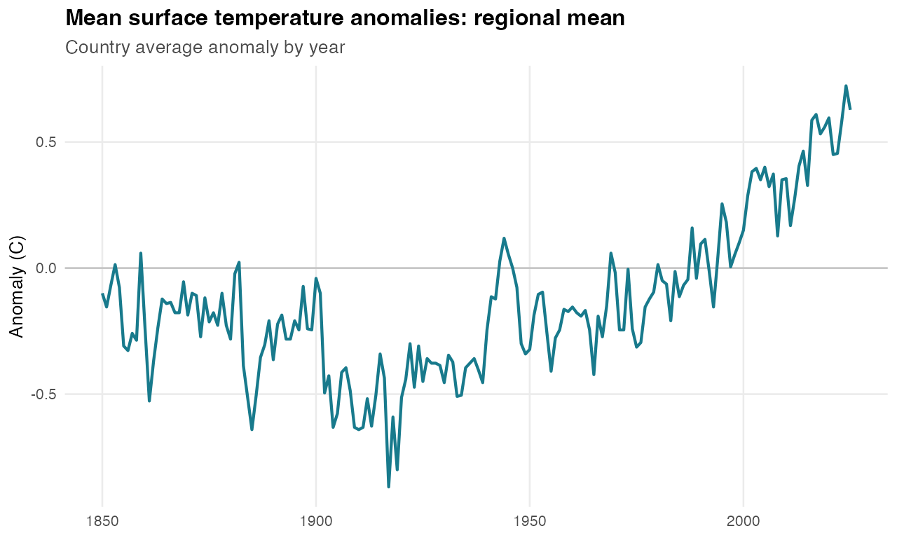
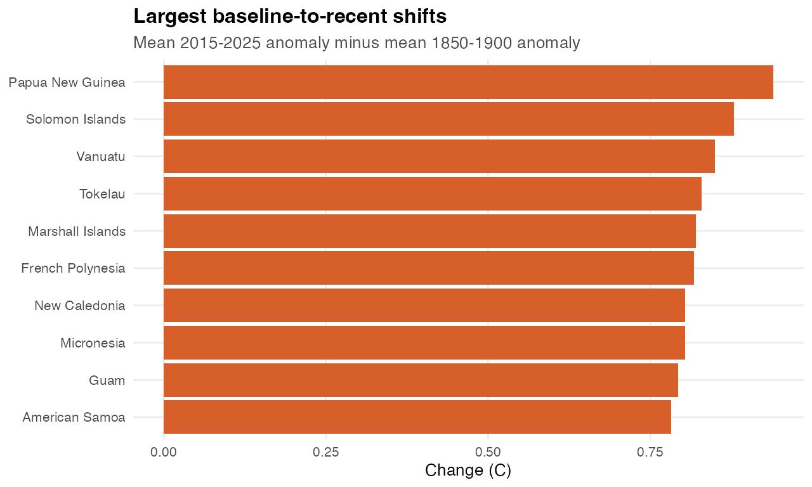

# Mean surface temperature anomalies

Generated: 2026-06-02 15:23 CEST

Rows explored: 3872 country-year observations
Coverage: 22 geographies, 1850-2025
Unit: CELSIUS
Source API: https://stats.pacificdata.org/vis?lc=en&df[ds]=SPC2&df[id]=DF_CLIMATE_CHANGE&df[ag]=SPC&df[vs]=1.0&av=true&dq=A.ST_ANOM.&pd=,&to[TIME_PERIOD]=false

## Strongest Story Signals

| Story | Evidence | Chart |
|---|---|---|
| The baseline moved | Regional surface temperature anomaly rose from -0.22C in 1850-1900 to 0.55C in 2015-2025, a shift of 0.77C. | Regional line with historical baseline and recent decade annotation |
| The recent record cluster | 20 of 22 geographies have their highest observed anomaly in 2015 or later. | Map or lollipop showing record year by country |
| Different places, same warming direction | 22 of 22 geographies warmed between 1850-1900 and 2015-2025. | Ranked slope chart from 1850-1900 mean to 2015-2025 mean |
| Acceleration after 1980 | Regional trend changed from 0C/decade before 1980 to 0.165C/decade from 1980 onward. | Two-slope line chart or small multiple by country |

## Quick Charts

### Regional Anomaly Over Time

### Largest Baseline-To-Recent Shifts

## Countries To Feature

Largest shift from 1850-1900 to 2015-2025:

| Country | 1850-1900 mean | 2015-2025 mean | Change |
|---|---|---|---|
| Papua New Guinea | -0.27 | 0.67 | 0.94 |
| Solomon Islands | -0.21 | 0.67 | 0.88 |
| Vanuatu | -0.3 | 0.55 | 0.85 |
| Tokelau | -0.33 | 0.5 | 0.83 |
| Marshall Islands | -0.27 | 0.55 | 0.82 |

Highest recent anomaly:

| Country | 2015-2025 mean | Trend |
|---|---|---|
| Micronesia | 0.68 | 0.04C/decade |
| Papua New Guinea | 0.67 | 0.04C/decade |
| Solomon Islands | 0.67 | 0.04C/decade |
| Palau | 0.66 | 0.03C/decade |
| Northern Mariana Islands | 0.65 | 0.04C/decade |

Fastest full-period trend:

| Country | Trend | First value | Latest value |
|---|---|---|---|
| French Polynesia | 0.04C/decade | 1850: -0.6 | 2025: 0.5 |
| Vanuatu | 0.04C/decade | 1850: -0.4 | 2025: 0.9 |
| Tokelau | 0.04C/decade | 1850: 0 | 2025: 0.4 |
| Marshall Islands | 0.04C/decade | 1850: -0.1 | 2025: 0.4 |
| Papua New Guinea | 0.04C/decade | 1850: -0.1 | 2025: 1.1 |

## Dataviz Fit

- Best as a clean time-series story: the shape is simple, long-running, and directly climate-linked.
- Strong candidate for small multiples because most geographies move in the same direction but at different speeds.
- Pair with crop yield, disaster affected persons, or sea level only after the warming narrative is visually clear.

