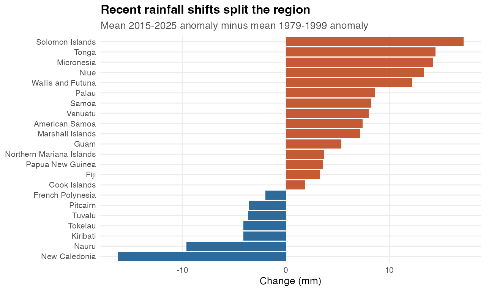
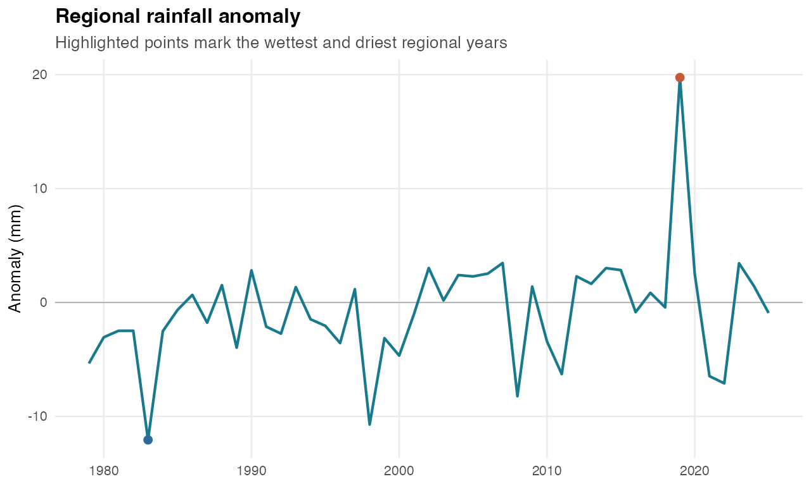
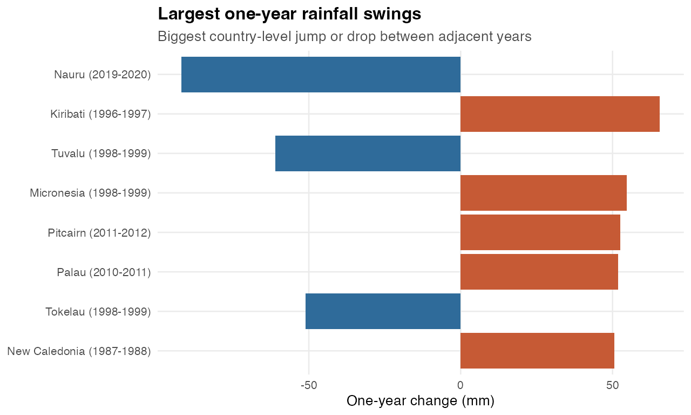

# Rainfall anomalies

Generated: 2026-06-02 15:23 CEST

Rows explored: 1034 country-year observations
Coverage: 22 geographies, 1979-2025
Unit: MM
Source API: https://stats.pacificdata.org/vis?lc=en&df[ds]=SPC2&df[id]=DF_CLIMATE_CHANGE&df[ag]=SPC&df[vs]=1.0&av=true&dq=A.RAIN_ANOM.&pd=,&to[TIME_PERIOD]=false

## Strongest Story Signals

| Story | Evidence | Chart |
|---|---|---|
| Rainfall is a volatility story | Nauru has the highest standard deviation at 30.71 mm. | Country volatility ranking or dot plot |
| Countries diverge between wetter and drier recent decades | Largest recent drying: New Caledonia (-16.24 mm). Largest wetting: Solomon Islands (+17.18 mm). | Diverging bar chart of recent shift from 1979-1999 to 2015-2025 |
| The sharpest changes are sudden | Nauru shifted from 66.6 mm in 2019 to -25.3 mm in 2020. | Before/after year-to-year lollipop for selected countries |
| Regional years can be annotated as wet/dry episodes | Regional mean was wettest in 2019 (19.75 mm) and driest in 1983 (-12.06 mm). | Regional anomaly line with highlighted wettest and driest years |

## Quick Charts

### Recent Rainfall Shifts

### Regional Rainfall Anomaly

### Largest One-Year Swings

## Countries To Feature

Largest recent drying:

| Country | 1979-1999 mean | 2015-2025 mean | Change |
|---|---|---|---|
| New Caledonia | 8.38 | -7.85 | -16.24 |
| Nauru | 2.4 | -7.22 | -9.62 |
| Kiribati | 1.98 | -2.14 | -4.11 |
| Tokelau | 1.07 | -3.05 | -4.11 |
| Tuvalu | 3.09 | -0.59 | -3.68 |

Largest recent wetting:

| Country | 1979-1999 mean | 2015-2025 mean | Change |
|---|---|---|---|
| Solomon Islands | -5.42 | 11.76 | +17.18 |
| Tonga | -9.82 | 4.65 | +14.48 |
| Micronesia | -6.63 | 7.57 | +14.21 |
| Niue | -8.1 | 5.21 | +13.31 |
| Wallis and Futuna | -7.12 | 5.11 | +12.23 |

Largest one-year swings:

| Country | Years | Values | Swing |
|---|---|---|---|
| Nauru | 2019-2020 | 66.6 -> -25.3 | -91.9 |
| Kiribati | 1996-1997 | -25.2 -> 40.4 | 65.6 |
| Tuvalu | 1998-1999 | 25.5 -> -35.6 | -61.1 |
| Micronesia | 1998-1999 | -39.4 -> 15.2 | 54.6 |
| Pitcairn | 2011-2012 | -28.3 -> 24.2 | 52.5 |

## Dataviz Fit

- Best as a volatility and divergence story, not a simple upward-trend chart.
- Strong chart candidates: diverging recent-shift bars, country small multiples, or an extreme-year calendar.
- Pair with crop yield or disaster affected persons if a food-security or human-impact angle is needed.

