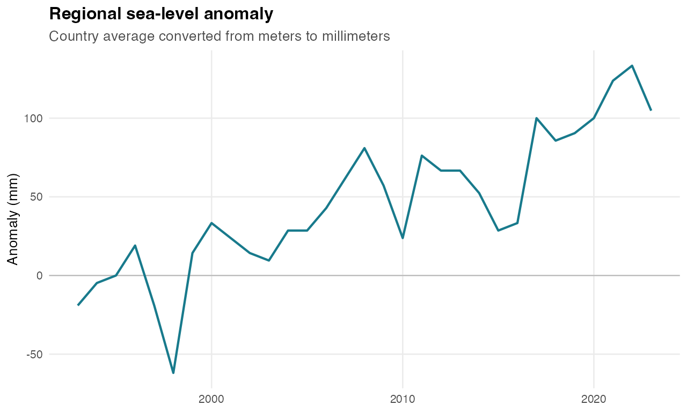
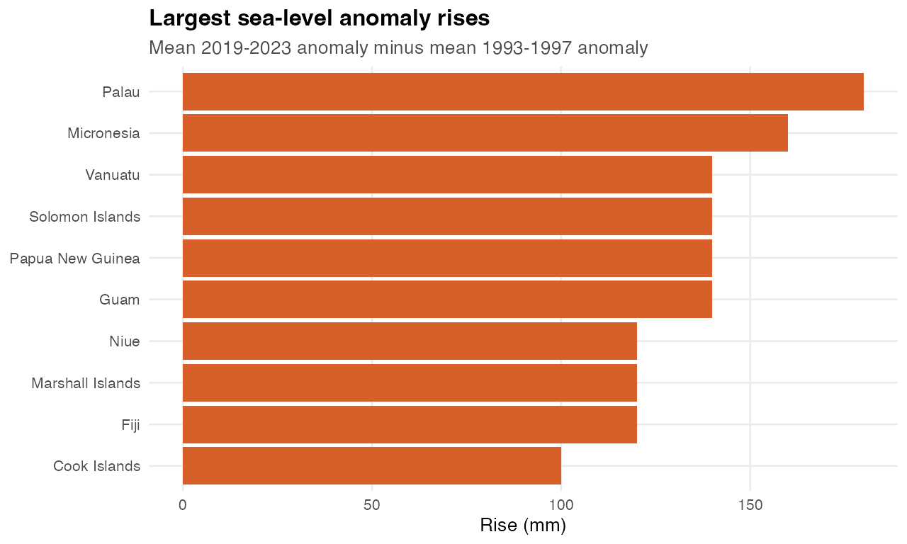

# Sea level anomalies

Generated: 2026-06-02 15:23 CEST

Rows explored: 651 country-year observations
Coverage: 21 geographies, 1993-2023
Unit: METER
Source API: https://stats.pacificdata.org/vis?lc=en&df[ds]=SPC2&df[id]=DF_CLIMATE_CHANGE&df[ag]=SPC&df[vs]=1.0&av=true&dq=A.SEA_LVL.&pd=,&to[TIME_PERIOD]=false

## Strongest Story Signals

| Story | Evidence | Chart |
|---|---|---|
| Small annual changes become visible over three decades | Regional mean shifted from -4.76 mm in 1993-1997 to 110.5 mm in 2019-2023, a rise of 115.2 mm. | Annotated regional line from 1993 to 2023 |
| Sea level rise is geographically uneven | Palau has the largest early-to-recent rise at 180 mm. | Ranked bar chart or slope chart by country |
| Several recent highs stand out | 8 of 21 geographies have their highest sea-level anomaly in 2018 or later. | Record-year map or timeline |
| A direct bridge to coastline and population stories | The dataset is strongest when paired with coastline, population growth, or disaster affected persons. | Small map plus time-series panels |

## Quick Charts

### Regional Sea-Level Anomaly

### Largest Sea-Level Rises

## Countries To Feature

Largest rise from 1993-1997 to 2019-2023:

| Country | 1993-1997 mean | 2019-2023 mean | Rise |
|---|---|---|---|
| Palau | -60 mm | 120 mm | 180 mm |
| Micronesia | -40 mm | 120 mm | 160 mm |
| Guam | -40 mm | 100 mm | 140 mm |
| Papua New Guinea | -20 mm | 120 mm | 140 mm |
| Solomon Islands | 0 mm | 140 mm | 140 mm |

Fastest linear trend:

| Country | Trend | Latest value |
|---|---|---|
| Papua New Guinea | 5.4 mm/year | 2023: 100 mm |
| Solomon Islands | 5.12 mm/year | 2023: 100 mm |
| Niue | 4.92 mm/year | 2023: 100 mm |
| Palau | 4.84 mm/year | 2023: 100 mm |
| Micronesia | 4.64 mm/year | 2023: 100 mm |

## Dataviz Fit

- Best as a direct climate-impact story because the unit can be converted into millimeters.
- Use annotations carefully: values are anomalies, not absolute sea level height.
- Pair with coastline as a map layer only after the time trend is clear.

