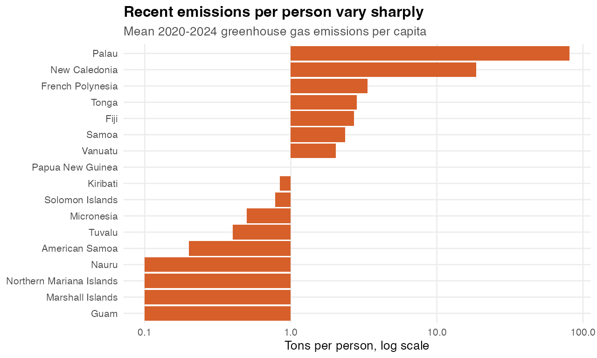
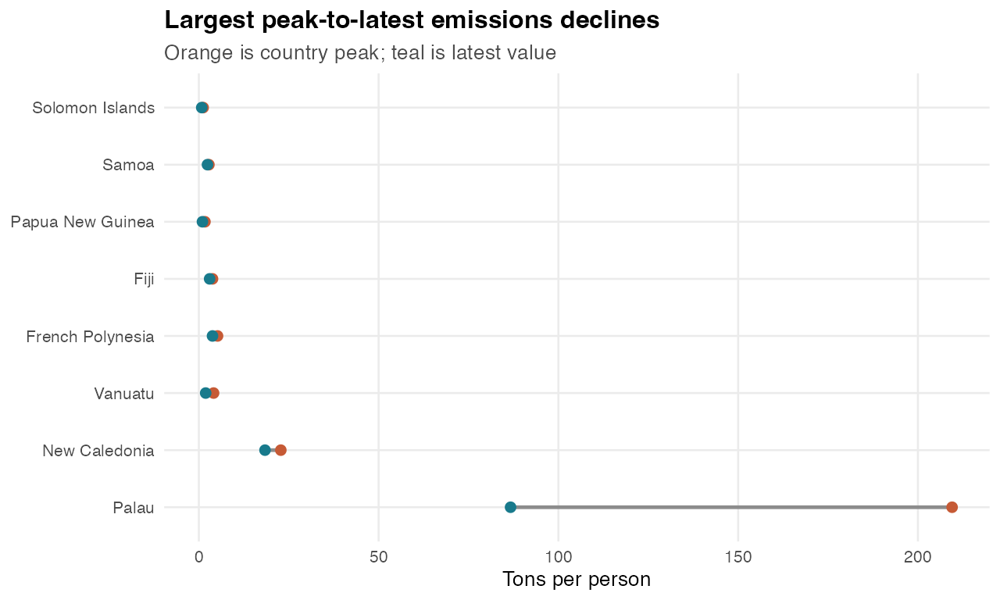

# Greenhouse gas emissions per capita

Generated: 2026-06-02 15:23 CEST

Rows explored: 935 country-year observations
Coverage: 17 geographies, 1970-2024
Unit: TON
Source API: https://stats.pacificdata.org/vis?lc=en&df[ds]=SPC2&df[id]=DF_CLIMATE_CHANGE&df[ag]=SPC&df[vs]=1.0&av=true&dq=A.GHG_EMI_CAPITA.&pd=,&to[TIME_PERIOD]=false

## Strongest Story Signals

| Story | Evidence | Chart |
|---|---|---|
| The Pacific is not one emissions story | Recent per-capita emissions range from Guam at 0.1 tons to Palau at 80.96 tons, a ratio of about 809.6x. | Recent ranking bar chart with log or broken-axis caution |
| Responsibility and vulnerability can be contrasted | This dataset can sit beside sea level or disaster impact data to show emitter-vs-exposed contrasts. | Two-panel chart: emissions rank beside sea-level/disaster indicator |
| Some countries peaked and fell | Palau fell from a peak of 209.5 tons in 2012 to 86.7 tons in 2024. | Peak-to-latest lollipop chart |
| Recent direction differs by country | 6 of 17 geographies have lower recent emissions than their 2000-2004 average. | Small multiples grouped by rising vs falling emissions |

## Quick Charts

### Recent Emissions Contrast

### Largest Peak-To-Latest Declines

## Countries To Feature

Highest recent per-capita emissions:

| Country | 1970-1979 mean | 2020-2024 mean | Change |
|---|---|---|---|
| Palau | 176.2 | 80.96 | -95.23 |
| New Caledonia | 12.43 | 18.58 | 6.15 |
| French Polynesia | 1.75 | 3.34 | 1.59 |
| Tonga | 1 | 2.84 | 1.84 |
| Fiji | 2.86 | 2.7 | -0.16 |

Lowest recent per-capita emissions:

| Country | 2020-2024 mean | Trend |
|---|---|---|
| Guam | 0.1 | -0.02 tons/decade |
| Marshall Islands | 0.1 | 0 tons/decade |
| Northern Mariana Islands | 0.1 | 0 tons/decade |
| Nauru | 0.1 | 0 tons/decade |
| American Samoa | 0.2 | 0 tons/decade |

Largest peak-to-latest declines:

| Country | Peak | Latest | Decline |
|---|---|---|---|
| Palau | 2012: 209.5 | 2024: 86.7 | -122.8 |
| New Caledonia | 2018: 22.8 | 2024: 18.4 | -4.4 |
| Vanuatu | 1974: 4.1 | 2024: 1.9 | -2.2 |
| French Polynesia | 1987: 5.2 | 2024: 3.8 | -1.4 |
| Fiji | 2004: 3.8 | 2024: 3 | -0.8 |

## Dataviz Fit

- Best as a contrast dataset, not as the only climate story.
- Pair with sea level anomalies or disaster affected persons to show responsibility versus exposure.
- Per-capita values can be volatile for small populations; annotate peaks and avoid implying total emissions.

