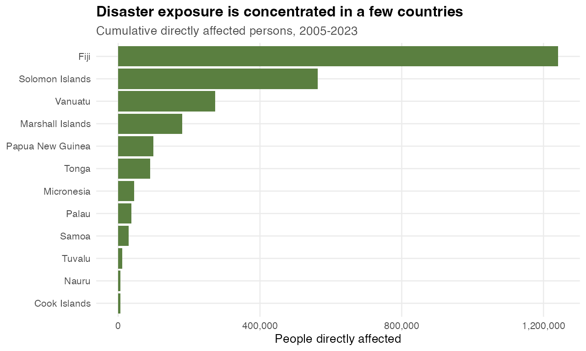
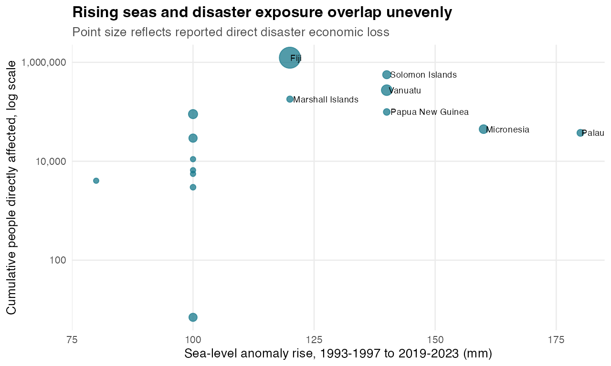
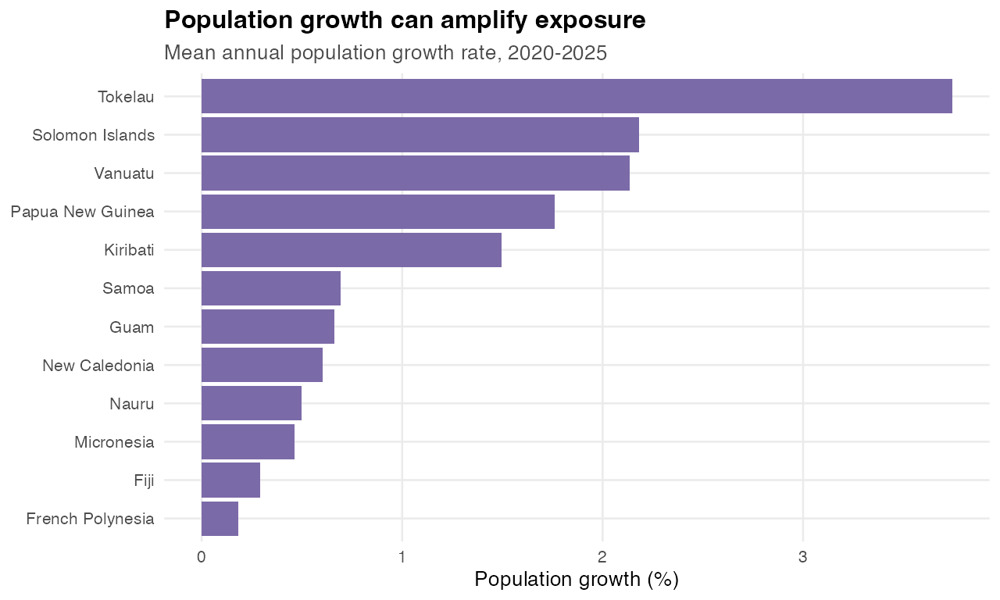

# Rising Seas Are Becoming A Human Exposure Story

**Core point:** The strongest narrative is not sea level alone; it is the overlap between rising sea-level anomalies, disaster exposure, economic loss, and population pressure.

Generated: 2026-06-06 08:06 CEST

## Why This Story Works

- It starts with a direct climate signal: sea-level anomaly rises over the satellite period.
- It translates that signal into human stakes using disaster-affected persons and direct economic loss.
- It keeps causality honest: disaster indicators do not prove sea level caused the losses, but they identify where climate exposure and social vulnerability can be shown together.
- It has a simple visual arc: regional sea-level line, country sea-level ranking, human exposure ranking, then a combined exposure scatter.

## Official Data Sources

| Dataset | API URL |
|---|---|
| Sea level anomalies | https://stats-nsi-stable.pacificdata.org/rest/data/SPC,DF_CLIMATE_CHANGE,1.0/A.SEA_LVL./all?dimensionAtObservation=AllDimensions&detail=full&format=csvfile |
| Number of directly affected persons attributed to disasters | https://stats-nsi-stable.pacificdata.org/rest/data/SPC,DF_SDG_11,3.0/A.VC_DSR_AFFCT........./all?dimensionAtObservation=AllDimensions&detail=full&format=csvfile |
| Direct disaster economic loss | https://stats-nsi-stable.pacificdata.org/rest/data/SPC,DF_SDG_11,3.0/A.VC_DSR_AALT...._T...../all?dimensionAtObservation=AllDimensions&detail=full&format=csvfile |
| Population growth | https://stats-nsi-stable.pacificdata.org/rest/data/SPC,DF_NMDI_POP,1.0/A..NMDI0002._T._T._T../all?dimensionAtObservation=AllDimensions&detail=full&format=csvfile |

## Core Evidence

| Finding | Evidence |
|---|---|
| Regional sea-level anomaly rose substantially | -4.76 mm in 1993-1997 to 110.5 mm in 2019-2023, a rise of 115.2 mm. |
| Largest country-level sea-level rise | Palau rose 180 mm between the early and recent periods. |
| Largest cumulative human exposure | Fiji has 1,240,734 directly affected persons reported across 2005-2023. |
| Largest reported economic loss | Fiji reports about USD 616,943,838 in direct disaster economic losses across 2007-2020. |

## Quick Charts

### Regional Sea-Level Anomaly

### Largest Sea-Level Rises

### Cumulative Disaster-Affected Persons

### Sea-Level Rise vs Disaster Exposure

### Recent Population Growth

## Suggested Dataviz Structure

1. Open with the regional sea-level anomaly line.
2. Show which countries have the largest early-to-recent sea-level anomaly rise.
3. Introduce disaster-affected persons to shift from physical climate signal to human stakes.
4. Use the combined scatter to show that exposure is uneven and multi-dimensional.
5. Use population growth as a final context layer for future exposure.

## Caveats

- Sea-level values are anomalies, not absolute local sea height.
- Disaster affected persons and losses are reported disaster indicators; they should not be treated as exclusively sea-level-driven.
- Economic loss coverage is sparse compared with sea-level coverage, so it works best as an annotation or point-size layer.

## Files Written

- `country_exposure_metrics.csv`
- `story.md`
- `charts/*.png`

