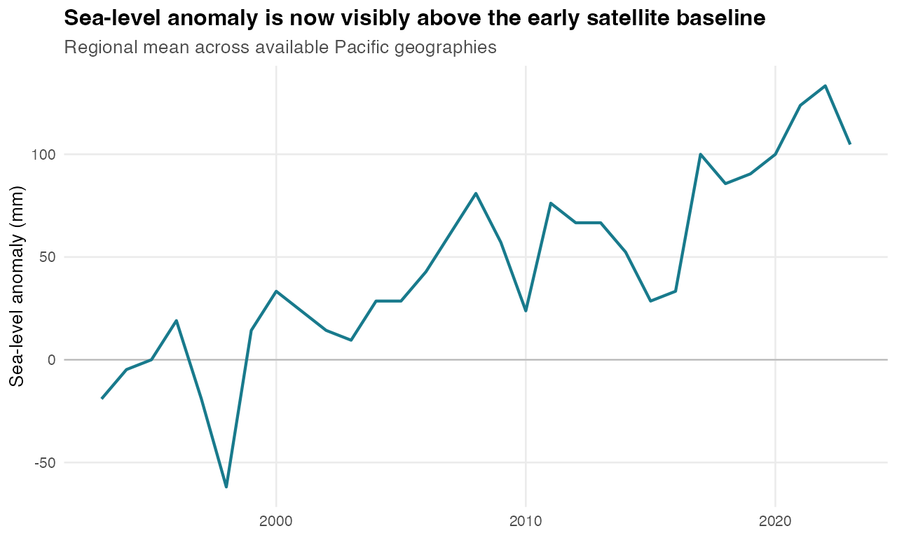
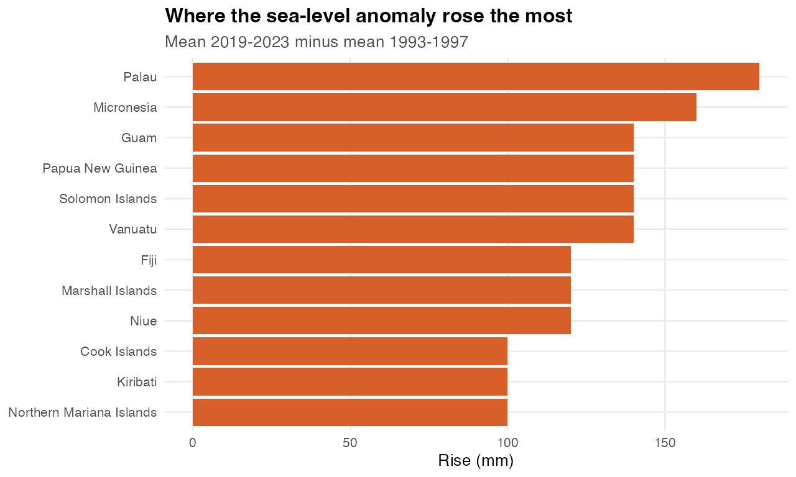

# Story 1: Rising Seas Are Becoming A Human Exposure Story

**Core point:** The strongest narrative is not sea level alone; it is the overlap between rising sea-level anomalies, disaster exposure, economic loss, and population pressure.

Generated: 2026-06-02 17:49 CEST

## Why This Story

- It has a single clear climate signal: sea-level anomaly rises over the satellite period.
- It translates that physical signal into human stakes using disaster-affected persons and economic loss.
- It can be visualized with simple, legible charts: a line, ranked bars, and a country scatter.
- It keeps causality honest: the disaster data does not prove sea level caused the losses, but it shows where climate exposure and social vulnerability can be brought into the same frame.

## Official Datasets Used

| Dataset | Source |
|---|---|
| Sea level anomalies | Pacific Data Hub .Stat, DF_CLIMATE_CHANGE / SEA_LVL |
| Number of directly affected persons attributed to disasters | Pacific Data Hub .Stat, DF_SDG_11 / VC_DSR_AFFCT |
| Direct disaster economic loss | Pacific Data Hub .Stat, DF_SDG_11 / VC_DSR_AALT |
| Population growth | Pacific Data Hub .Stat, DF_NMDI_POP / NMDI0002 |

## Core Evidence

| Finding | Evidence |
|---|---|
| Regional sea-level anomaly rose substantially | -4.76 mm in 1993-1997 to 110.5 mm in 2019-2023, a rise of 115.2 mm. |
| Largest country-level sea-level rise | Palau rose 180 mm between the early and recent periods. |
| Largest cumulative human exposure | Fiji has 1,240,734 directly affected persons reported across 2005-2023. |
| Largest reported economic loss | Fiji reports about USD 616,943,838 in direct disaster economic losses across 2007-2020. |

## Quick Charts

### Regional Sea-Level Anomaly

### Largest Sea-Level Rises

### Cumulative Disaster-Affected Persons

### Sea-Level Rise vs Disaster Exposure

### Recent Population Growth

## Suggested Dataviz Direction

- Lead with the sea-level anomaly line to establish the climate signal.
- Move to ranked country bars to show that the rise is not evenly distributed.
- End with the scatter or side-by-side country panels to connect physical exposure with people affected and losses.
- A strong title direction: `The sea-level story is becoming a people story`.

## Caveats

- Sea level values are anomalies, not absolute local sea height.
- Disaster affected persons and losses are reported disaster indicators; they should not be treated as exclusively sea-level-driven.
- Economic loss coverage is sparse compared with sea-level coverage, so it is best used as an annotation or point-size layer.

