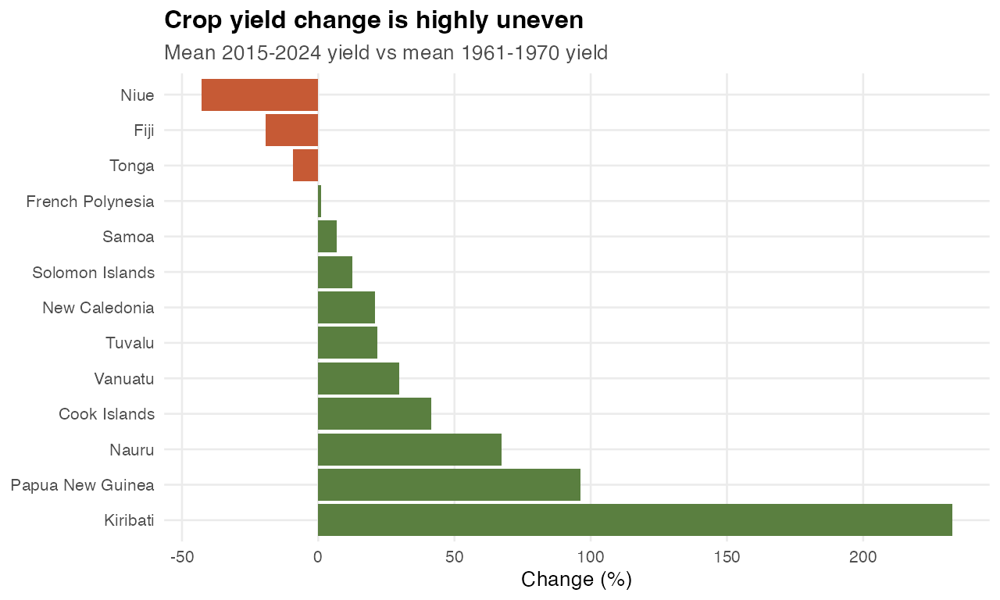
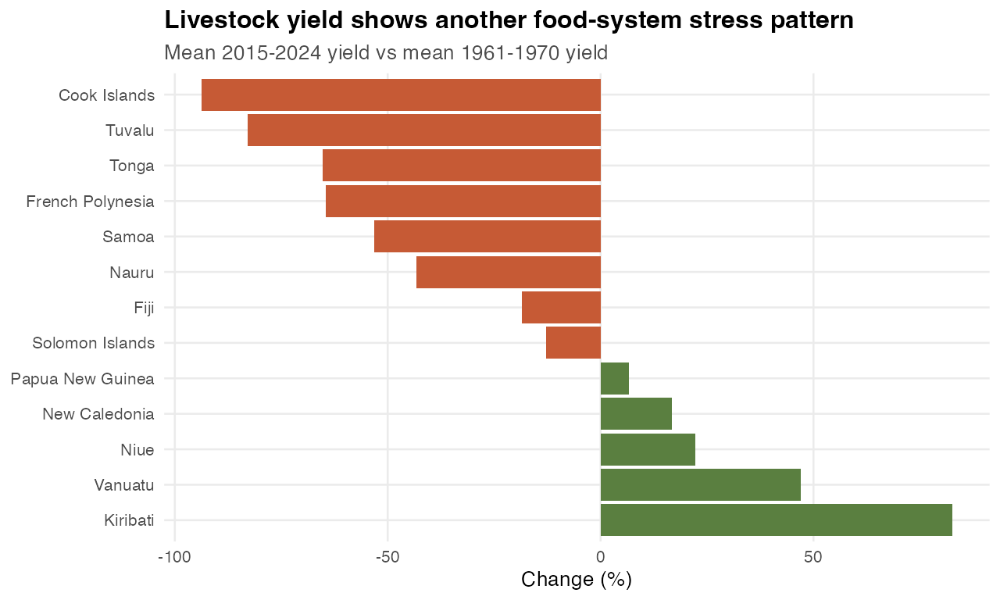
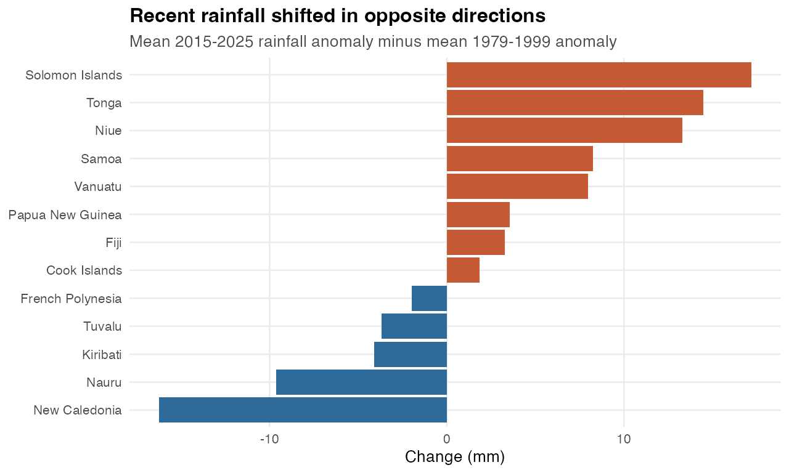
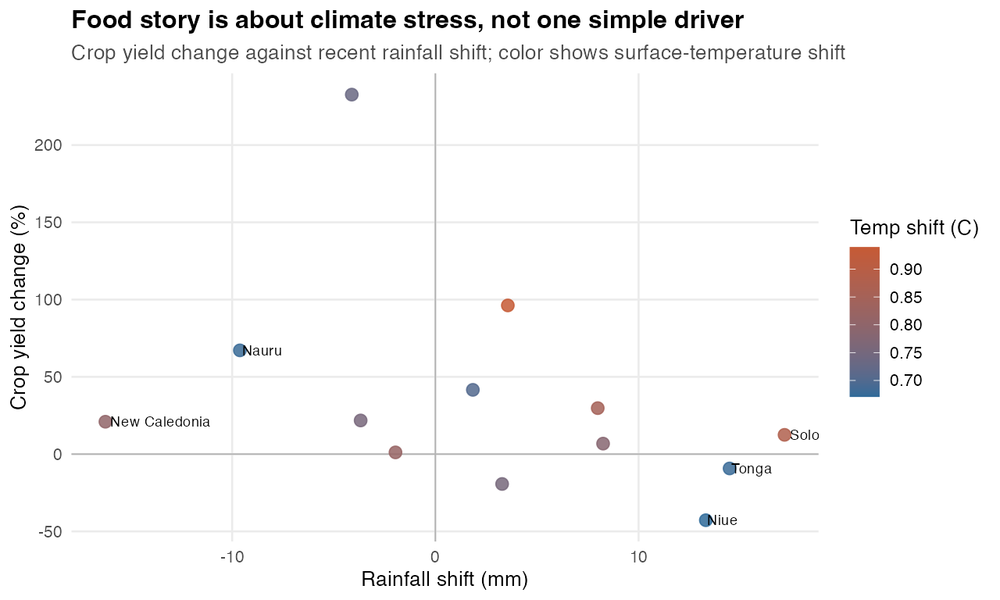

# Story 2: Food Systems Are Meeting A Less Predictable Climate

**Core point:** The most defensible food story is about uneven agricultural stress under warming and divergent rainfall, not a single universal crop-climate relationship.

Generated: 2026-06-02 17:49 CEST

## Why This Story

- It uses food-system datasets that were not in the first top-5 deep dive: crop yield and livestock yield.
- It connects those outcomes to two direct climate signals: rainfall anomalies and surface-temperature anomalies.
- It has visual contrast: some countries show steep crop or livestock declines, while rainfall shifts split the region into wetter and drier recent periods.
- It is story-friendly because the point is nuanced: climate stress is regional, but food outcomes are local and uneven.

## Official Datasets Used

| Dataset | Source |
|---|---|
| Crop yield | Pacific Data Hub .Stat, DF_CLIMATE_CHANGE / CROP_YIELD |
| Livestock yield | Pacific Data Hub .Stat, DF_CLIMATE_CHANGE / LVST_YIELD |
| Rainfall anomalies | Pacific Data Hub .Stat, DF_CLIMATE_CHANGE / RAIN_ANOM |
| Mean surface temperature anomalies | Pacific Data Hub .Stat, DF_CLIMATE_CHANGE / ST_ANOM |

## Core Evidence

| Finding | Evidence |
|---|---|
| Largest crop-yield decline | Niue changed by -42.76% from the 1961-1970 baseline to 2015-2024. |
| Largest livestock-yield decline | Cook Islands changed by -93.68% from the 1961-1970 baseline to 2015-2024. |
| Strongest recent drying | New Caledonia shifted by -16.24 mm from 1979-1999 to 2015-2025. |
| Strongest recent wetting | Solomon Islands shifted by +17.18 mm from 1979-1999 to 2015-2025. |

## Quick Charts

### Crop Yield Change

### Livestock Yield Change

### Rainfall Shift

### Crop Yield vs Rainfall Shift

## Suggested Dataviz Direction

- Lead with crop and livestock yield change rankings to establish food-system stakes.
- Use rainfall divergence as the climate-context pivot: the region is not moving in one hydrological direction.
- Use the scatter as a cautionary/analytical panel: climate stress exists, but country outcomes need context.
- A strong title direction: `A warmer Pacific is not feeding every island the same way`.

## Caveats

- These are broad national yield indicators; they do not identify crop mix, farming systems, imports, or local adaptation.
- The charts show association and story context, not causal attribution.
- For a final visualization, choose 4-6 countries rather than plotting every country in every panel.

