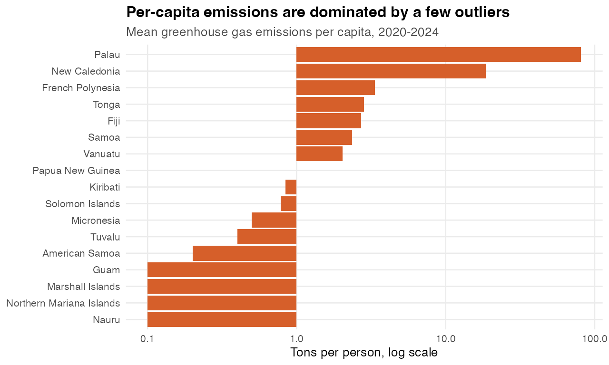
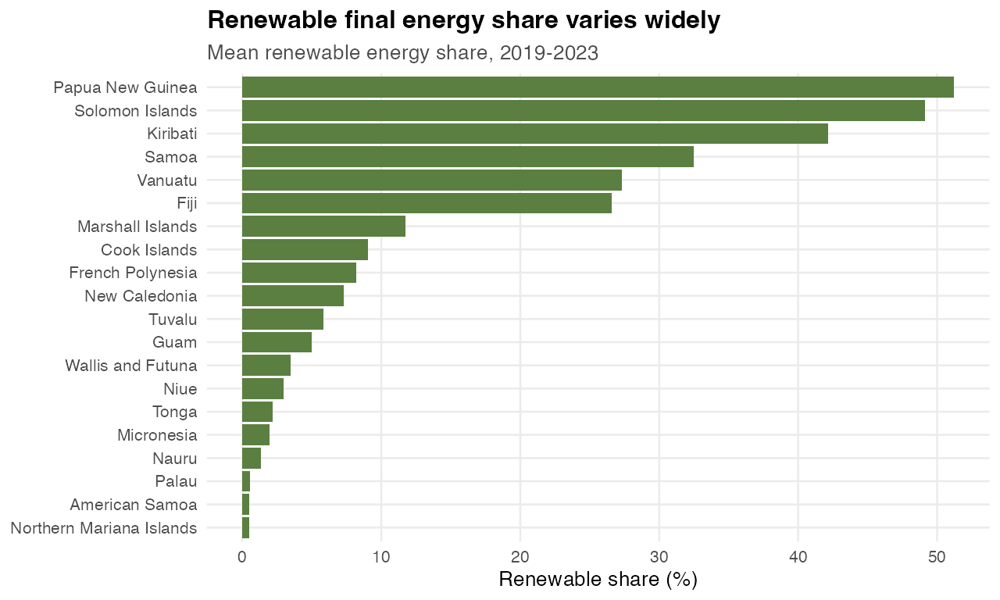
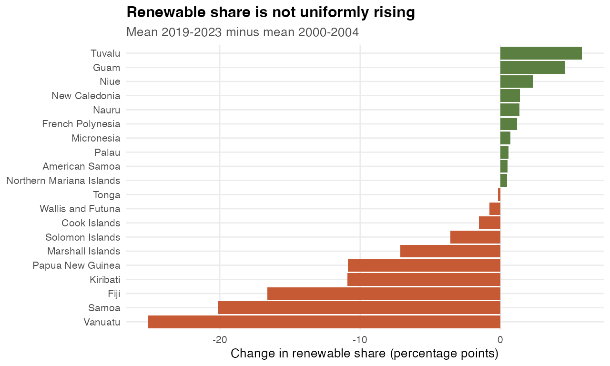
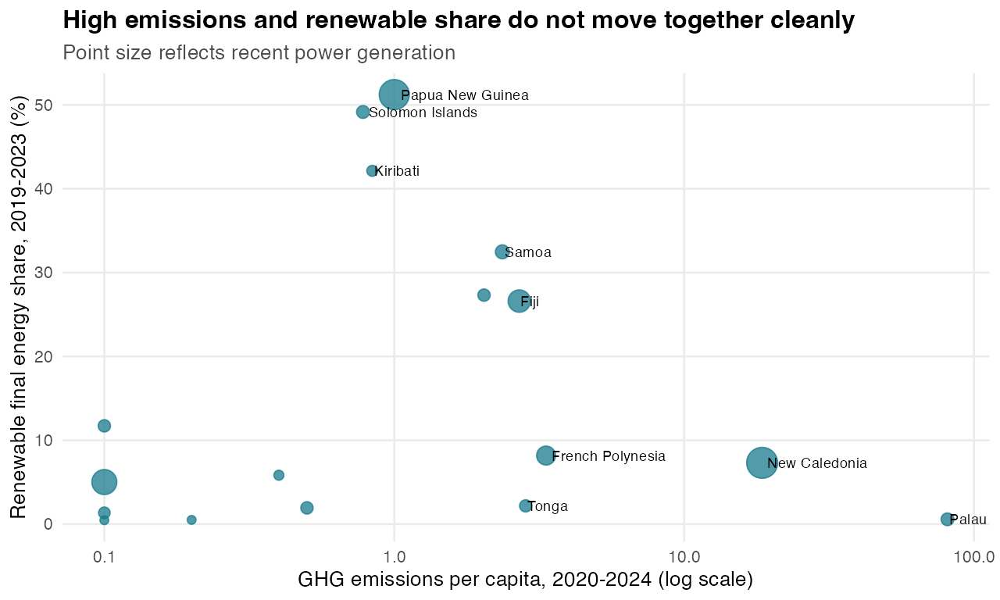
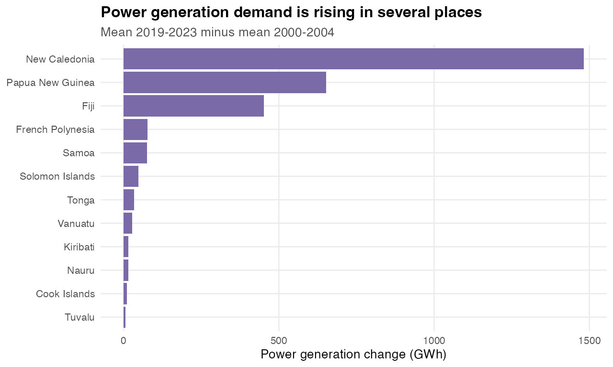
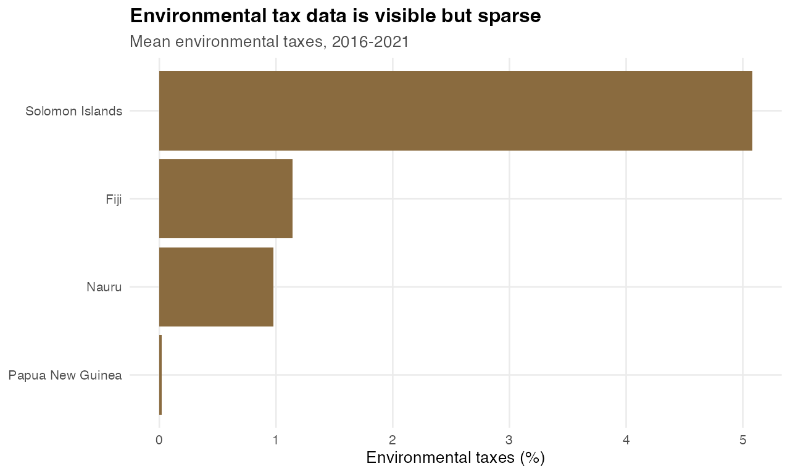

# Story 3: The Climate Transition Gap Is Uneven And Under-Measured

**Core point:** The energy-response story is less about one regional trend and more about gaps: emissions outliers, uneven renewable shares, growing power generation, and sparse policy-tax data.

Generated: 2026-06-02 17:49 CEST

## Why This Story

- It brings together the official mitigation-side datasets: emissions, renewable energy, power generation, and environmental taxes.
- It gives a strong contrast to the exposure and food stories: this is about responsibility and response.
- It has a clear editorial point: the transition is not moving uniformly, and some policy data is too sparse to carry the story alone.
- It has enough chart variety for a dashboard-style or scrollytelling section.

## Official Datasets Used

| Dataset                                                  | Source                                                     |
| -------------------------------------------------------- | ---------------------------------------------------------- |
| Greenhouse gas emissions per capita                      | Pacific Data Hub .Stat, DF_CLIMATE_CHANGE / GHG_EMI_CAPITA |
| Renewable energy share in total final energy consumption | Pacific Data Hub .Stat, DF_SDG / EG_FEC_RNEW               |
| Power generation                                         | Pacific Data Hub .Stat, DF_CLIMATE_CHANGE / POWER_GEN      |
| Environmental taxes                                      | Pacific Data Hub .Stat, DF_CLIMATE_CHANGE / ENV_TAXES      |

## Core Evidence

| Finding                               | Evidence                                                                          |
| ------------------------------------- | --------------------------------------------------------------------------------- |
| Highest recent per-capita emissions   | Palau averages 80.96 tons per person in 2020-2024.                                |
| Highest recent renewable energy share | Papua New Guinea averages 51.22% renewable final energy share in 2019-2023.       |
| Largest renewable-share decline       | Vanuatu changed by -25.12 percentage points from 2000-2004 to 2019-2023.          |
| Largest power generation growth       | New Caledonia added about 1,481 GWh from 2000-2004 to 2019-2023.                  |
| Environmental tax coverage            | Only 4 geographies have recent environmental tax values in this official extract. |

## Quick Charts

### Recent GHG Per Capita

### Recent Renewable Energy Share

### Renewable Share Change

### GHG vs Renewable Share

### Power Generation Change

### Environmental Tax Coverage

## Suggested Dataviz Direction

- Lead with the emissions ranking to create the responsibility contrast.
- Follow with renewable share and renewable change to show that energy transition is uneven.
- Use power generation growth as the pressure variable: demand keeps moving even when renewable share does not.
- Treat environmental taxes as a final caveat panel: policy response is difficult to compare because coverage is thin.
- A strong title direction: `The Pacific transition story is a gap story`.

## Caveats

- GHG per capita can be volatile for small populations and should not be read as total emissions.
- Renewable final energy share is not the same thing as renewable electricity generation.
- Environmental tax coverage is limited, so it should not be the main evidence for the story.
